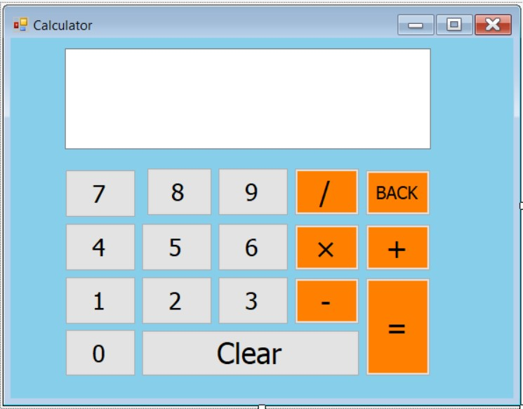

<h1>Simple-Windows-Calculator</h1>

Simple Windows calculator project for C# beginners.

<h2>User Interface</h2>

<h2>Features</h2> 
  <ul>
    <li>This app provides functionality like Windows Calculator in Standard mode.</li>
    <li>Simple UI Layout Includes a display screen, number buttons (0–9), operation buttons, equals =, backspace ←, and Clear.</li>
    <li>Supports up to 15-digit numbers at once.</li>
    <li>Basic Operations Supports addition (+), subtraction (−), multiplication (×), and division (÷).</li>
    <li>Expression Handling Allows users to enter complete math expressions (e.g. 12 + 3 × 4 − 6 ÷ 2).</li>
    <li>Two Clear Options</li>
    <ul>
      <li>Backspace: Deletes the last entered character.</li>
      <li>Clear All: Clears the entire screen.</li>
    </ul>         
    <li>Division by Zero Handling If user tries to divide by zero, the answer screen is automatically cleared.</li>
  </ul>
